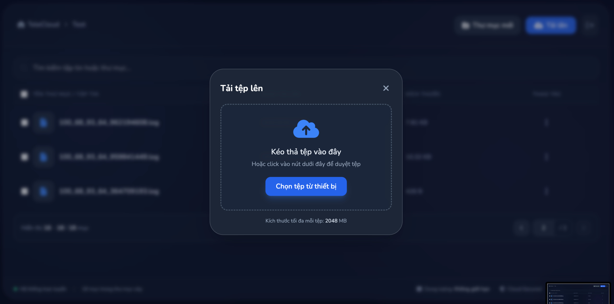
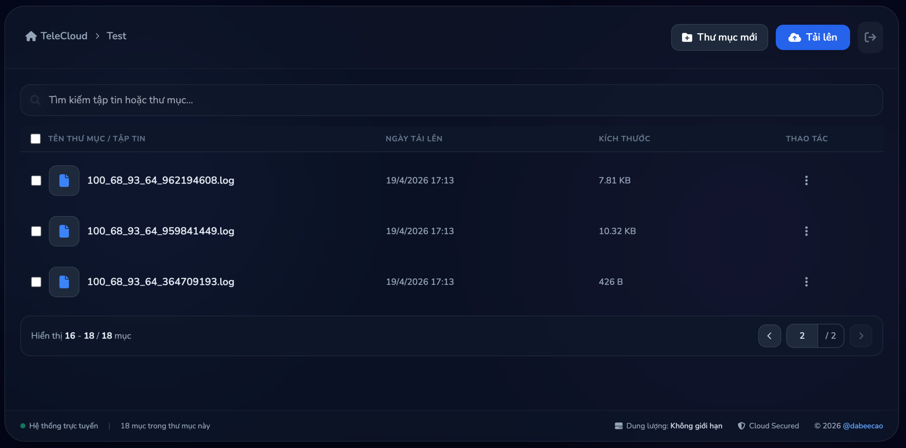
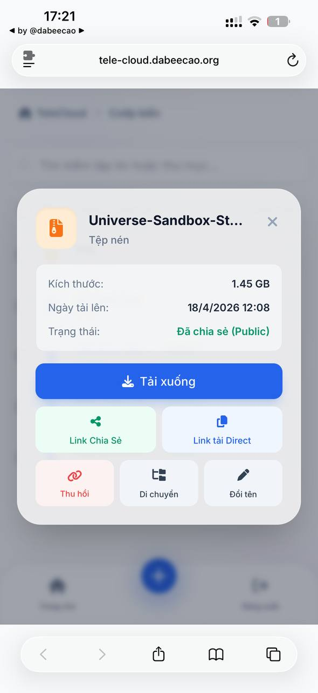
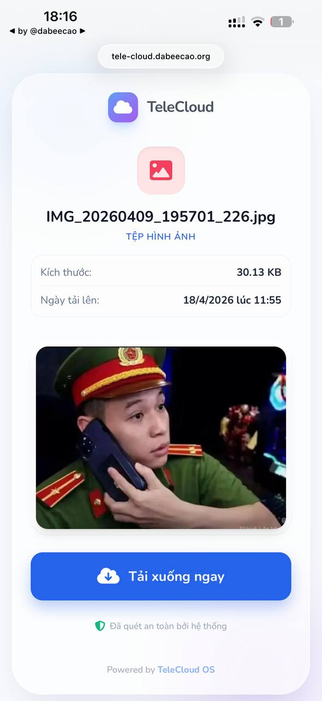
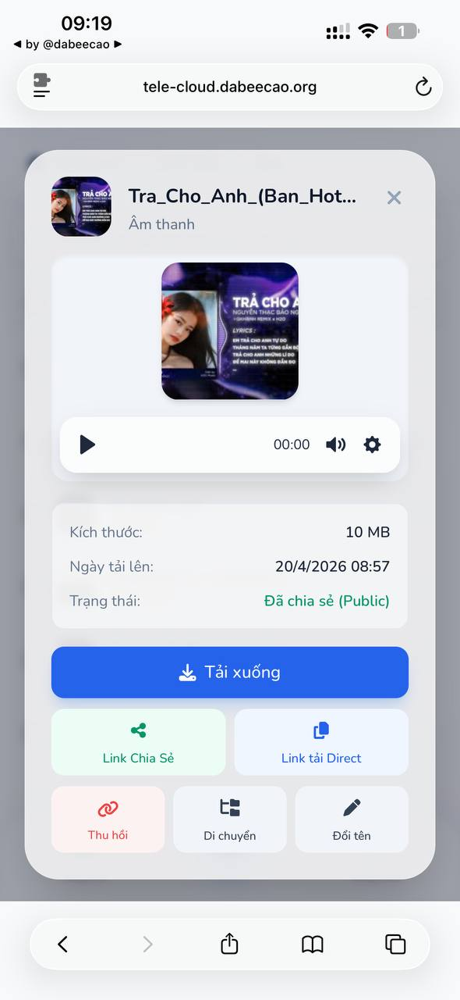
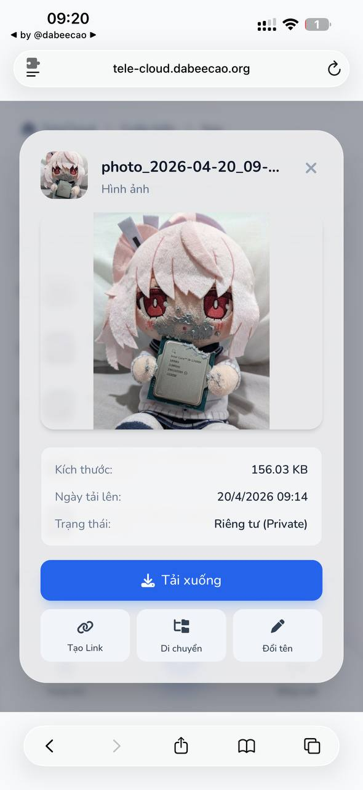
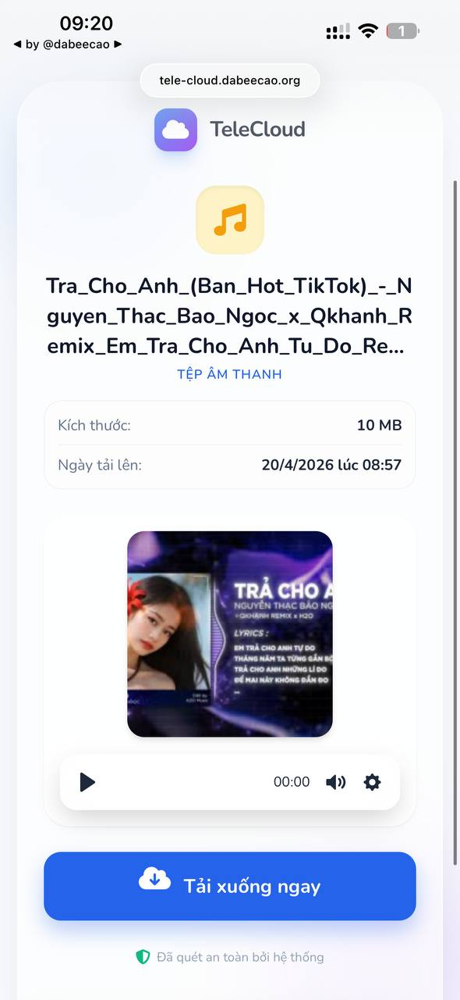

# TeleCloud

## ⚠️ Project Status

Dự án này đã **ngừng phát triển** và sẽ không nhận thêm bất kỳ bản cập nhật hay sửa lỗi nào trong tương lai.

🚀 TeleCloud hiện đã được chuyển sang phiên bản mới viết bằng **Golang**, mang lại hiệu năng cao hơn, tối ưu tài nguyên tốt hơn và khả năng mở rộng mạnh mẽ hơn.

👉 Vui lòng sử dụng phiên bản mới tại:
https://github.com/dabeecao/telecloud-go

---

### 🙏 Lưu ý
Repository này sẽ được giữ lại với mục đích tham khảo. Nếu bạn đang sử dụng phiên bản cũ, hãy cân nhắc migrate sang phiên bản Golang để có trải nghiệm tốt hơn.

---

TeleCloud là một dự án cho phép sử dụng chính dung lượng lưu trữ gần như vô tận của Telegram để lưu trữ và quản lý tệp.

Dự án hỗ trợ cả **Bot** và **Userbot** *(khuyến nghị dùng Userbot để có giới hạn tốt hơn)*.
Sử dụng các công nghệ như **Hydrogram**, **FastAPI** và **SQLite** giúp hệ thống nhẹ, nhanh và dễ triển khai.

---

## 📸 Ảnh xem trước giao diện

### 🖥️ Giao diện Máy tính
| | | |
| :---: | :---: | :---: |
|  |  |  |

### 📱 Giao diện Điện thoại
| | | | |
| :---: | :---: | :---: | :---: |
|  |  |  |  |

> *Giao diện được thiết kế tối ưu hóa cho mọi thiết bị (Responsive Design)*

## ✨ Tính năng

* 📁 Lưu trữ file trực tiếp trên Telegram
* 🔗 Trang share có preview file tiện lợi
* 🗂️ Trang quản lý có file browser
* ⬆️ Upload nhiều file cùng lúc
* 📦 Upload chia nhỏ (chunk) để tránh giới hạn từ Cloudflare proxy
* 🤖 Hỗ trợ cả Bot và Userbot

---

## ⚠️ Yêu cầu trước khi cài đặt

### 🎞️ Cài đặt FFmpeg (bắt buộc)

Dự án sử dụng **FFmpeg** để tạo thumbnail (thumb) cho video/file media.

#### (Ubuntu/Debian)

```bash
sudo apt install ffmpeg
```
#### Alpine Linux

```bash
apk add ffmpeg
```

#### Redhat-based Linux

```bash
dnf install ffmpeg
```

#### Kiểm tra:

```bash
ffmpeg -version
```

---

## ⚙️ Cài đặt

```bash
cp ./env.example ./.env
pip install -r requirements.txt
```

---

## 🔧 Cấu hình `.env`

```env
API_ID=12xxxxx
API_HASH=abcxxxxxxxxxxx

# Để trống SESSION_STRING trước, sẽ tạo ở bước dưới
SESSION_STRING=

# Điền BOT_TOKEN nếu dùng Bot.
BOT_TOKEN=

# Thay vì ID nhóm, bạn có thể dùng "me" để lưu vào Saved Messages (chỉ áp dụng cho Userbot)
LOG_GROUP_ID=-1003900839462

ADMIN_PASSWORD=xxxxx

# Nếu có Telegram Premium bạn có thể nâng lên 4096 (chỉ Userbot)
MAX_UPLOAD_SIZE_MB=2048

PORT=8091
```

---

## 🔑 Lấy API_ID và API_HASH

1. Truy cập: https://my.telegram.org
2. Đăng nhập bằng số điện thoại Telegram
3. Chọn **API development tools**
4. Tạo app mới
5. Lấy:

   * `API_ID`
   * `API_HASH`

---

## 🤖 Lấy BOT_TOKEN (nếu dùng Bot)

1. Mở Telegram → tìm **@BotFather**
2. Gõ `/newbot`
3. Làm theo hướng dẫn
4. Nhận `BOT_TOKEN` và điền vào `.env`

---

## 🔐 Tạo SESSION_STRING (Userbot - khuyến nghị)

Dự án đã có sẵn script lấy SESSION_STRING.

---

### ▶️ Cách sử dụng

```bash
python3 get-session.py
```

* Nhập mã đăng nhập Telegram
* Sau khi xong, bạn sẽ nhận được:

```env
SESSION_STRING=xxxxxxxxxxxxxxxx
```

👉 Copy và dán lại vào file `.env`

---

## 📡 Lấy LOG_GROUP_ID

* Tạo group Telegram
* Thêm bot hoặc userbot vào
* Gửi 1 tin nhắn

ID sẽ có dạng:

```
-100xxxxxxxxxx
```

---

## 🐳 Chạy bằng Docker

### 1. Chuẩn bị file môi trường

```bash
cp ./env.example ./.env
```

Sau đó chỉnh lại các giá trị trong `.env` như `API_ID`, `API_HASH`, `SESSION_STRING` hoặc `BOT_TOKEN`, `LOG_GROUP_ID`, `ADMIN_PASSWORD`.

### 2. Chạy bằng Docker Compose

```bash
docker compose up -d --build
```

Truy cập:

```
http://localhost:8091
```

Dữ liệu sẽ được lưu bền vững tại:

* `./data/database.db`
* `./data/thumbs/`

Khi cần dừng:

```bash
docker compose down
```

### 3. Chạy bằng Docker thuần

Build image:

```bash
docker build -t telecloud .
```

Chạy container:

```bash
docker run --env-file .env -p 8091:8091 telecloud
```

Nếu muốn lưu bền dữ liệu khi chạy Docker thuần, bạn có thể mount thư mục `data`:

```bash
mkdir -p data
docker run --env-file .env \
  -e DATABASE_PATH=/data/database.db \
  -e THUMBS_DIR=/data/thumbs \
  -p 8091:8091 \
  -v "$(pwd)/data:/data" \
  telecloud
```

---

## 🚀 Chạy dự án

```bash
python3 main.py
```

Sau khi chạy, truy cập:

```
http://localhost:8091
```

---

## 📌 Ghi chú

* Userbot có giới hạn upload cao hơn Bot
* Có thể dùng `"me"` để lưu vào **Saved Messages**
* Chunk upload giúp bypass giới hạn Cloudflare
* SQLite giúp setup nhanh, không cần database riêng
* Hãy khai dự án trên một tên miền có SSL (bạn có thể dùng **Cloudflare Tunnel, revert proxy,...**)

---

## ⚠️ Điều khoản sử dụng

Dự án **TeleCloud** được phát triển nhằm mục đích **lưu trữ, quản lý và chia sẻ tệp tin hợp pháp** thông qua nền tảng Telegram.

Khi sử dụng dự án này, bạn **đồng ý không sử dụng** vào các mục đích sau:

- ❌ Lưu trữ, phát tán nội dung vi phạm pháp luật
- ❌ Chia sẻ phần mềm lậu, crack, nội dung vi phạm bản quyền
- ❌ Phát tán mã độc, virus hoặc nội dung gây hại
- ❌ Lạm dụng hệ thống để spam, khai thác tài nguyên hoặc gây ảnh hưởng đến dịch vụ khác
- ❌ Vi phạm điều khoản sử dụng của Telegram

Chúng tôi **không chịu trách nhiệm** đối với bất kỳ nội dung nào được người dùng tải lên, lưu trữ hoặc chia sẻ thông qua hệ thống.

Người dùng hoàn toàn chịu trách nhiệm cho hành vi sử dụng của mình.


## 🛡️ Tuyên bố miễn trừ trách nhiệm

Dự án được cung cấp **"nguyên trạng" (as-is)**, không có bất kỳ đảm bảo nào về:

- Tính ổn định
- Tính bảo mật
- Khả năng phù hợp với mục đích sử dụng cụ thể

Tác giả **không chịu trách nhiệm** cho bất kỳ thiệt hại nào, bao gồm nhưng không giới hạn:

- Mất dữ liệu
- Gián đoạn dịch vụ
- Thiệt hại trực tiếp hoặc gián tiếp phát sinh từ việc sử dụng dự án


## 🙏 Đóng góp

Dự án này sử dụng thư viện:

- 🧩 **Hydrogram** – Thư viện Telegram client mạnh mẽ giúp xây dựng Userbot/Bot  
  👉 https://github.com/hydrogram/hydrogram

Xin cảm ơn đội ngũ phát triển Hydrogram đã cung cấp một công cụ hữu ích cho cộng đồng.

Một phần nội dung trong README này, cũng như một số đoạn mã trong dự án, có sự hỗ trợ từ Gemini AI.

---

## 📜 Giấy phép

Dự án này được phát hành dưới giấy phép [GNU Affero General Public License v3.0 (AGPL-3.0)](https://www.gnu.org/licenses/agpl-3.0.html).
